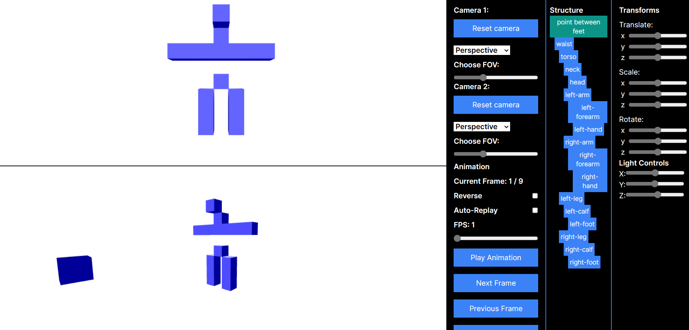

# 3D Engine

<p align="center" style="border-radius: 10px; box-shadow: rgba(99, 99, 99, 0.2) 0px 2px 8px 0px;">

</p>

## 🏹 Minimum Requirements
- Node.js v20 or later

## 🤖 How to Run Locally

1. Clone this repository
2. Execute `npm i` on terminal
3. Run the development server:
```bash
npm run dev
# or
yarn dev
# or
pnpm dev
# or
bun dev
```
4. Open [http://localhost:3000](http://localhost:3000) with your browser to see the result.

4. Open [http://localhost:3000](http://localhost:3000) with your browser to see the result.

### ✨ How to Use
Here are some of the functionalities of the app:

- Articulated and Hollow object.
- Translation, Rotation, and Scaling on each node.
- Play animations with tweening.
- Multi scene view with orbital control and perspective, orthographic, and oblique projection.

Panduan penggunaan dapat dilihat pada pdf di folder /docs ataupun pada link gdocs berikut
https://docs.google.com/document/d/1MoUSaDQ7525uhW5RNgqf-KDxu8huxqRLt37R6cwk_4g/edit
---


| Nama | NIM | Articulated + Animasi / Hollow | Pembagian Kerja |
|------|-----|------------------------------|-------|
| [Yanuar Sano Nur Rasyid](https://github.com/yansans) | 13521110 | Man + Prism | Shading |
| [Ahmad Ghulam Ilham](https://github.com/Agilham) | 13521118 | Drone + Locked-prism | Animation | 
| [Saddam Annais S](https://github.com/SaddamAnnais) | 13521121 | Lamp + Hexagon | Kamera |
| [William Nixon](https://github.com/williamnixon20) | 13521123 | Dog + Torus | Components |
